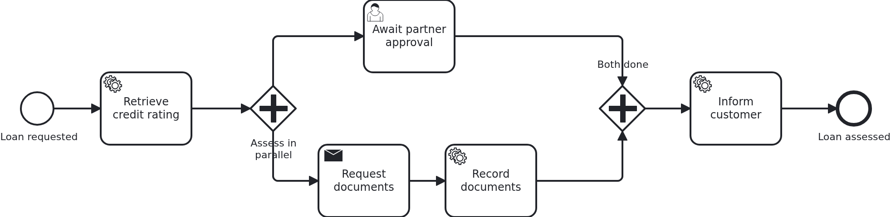

# Two branches writing one workflow aggregate

[](./LICENSE)

A workflow aggregate looks like it has a single writer, because it belongs to one workflow.
That holds until the process puts a second token into it. From then on two branches change
the same business case at the same time, in two transactions nobody coordinates, and a
persistence layer writing whole records lets the later commit undo the earlier one. Without
an exception, without a log line, with the process running exactly as modelled.

This blueprint shows the data model which makes the collision impossible, and a test which
produces the collision on purpose rather than hoping for it.

## What this blueprint shows



The loan approval of the base blueprint, with a parallel gateway after the credit rating.
One branch waits for a partner to answer through the API, the other collects documents from
a surrounding system. They run at the same time and join before the customer is informed.

The two branches are written by two different transactions:

- the document branch waits for the document service, and once the application says the
  documents are there, `recordDocuments` reads them. That handler runs in the transaction
  VanillaBP owns for its task.
- the partner branch waits at a user task, and the answer arrives through the API. That
  transaction belongs to the application.

What keeps them apart is the data model. The aggregate itself carries only what is written
while a single token exists: the request, the credit rating, and after the join the note
that the customer was informed. Everything a branch produces lives in an entity of that
branch, `PartnerApproval` and `DocumentCheck`. Both branches still save the aggregate's row,
which is harmless as long as neither of them changes a value in it.

The id of the open task follows the same rule. It sits on `PartnerApproval` rather than on
the aggregate, because the document branch reads the aggregate's row before that id exists
and writes it back unchanged afterwards.

VanillaBP says at startup that this process can hold more than one token while its aggregate
has no version attribute:

```
The BPMN process 'loan_approval' of workflow module 'loan-approval' can hold more than one
token at a time (e.g. 'Gateway_Split'), but its workflow aggregate has no version attribute
```

The warning is right and it stays, because this blueprint answers the question with the data
model instead of with a version attribute. The other three ways, and why they are alternatives
rather than opinions, are in
[the wiki](https://github.com/vanillabp/adapter-platform-integration/wiki/Workflow-aggregates#two-writers-on-one-aggregate).

## Delta to the base blueprint

Compared to [`module-single`](https://github.com/vanillabp-blueprints/module-single-springboot):

|             File             |                                     What is different                                      |
|------------------------------|--------------------------------------------------------------------------------------------|
| `loan_approval.bpmn`         | a parallel gateway splitting into two branches and joining them again                      |
| `model/Aggregate.java`       | carries only what a single token writes, plus a relation per branch                        |
| `model/PartnerApproval.java` | what the branch of the application writes, including the id of its open task               |
| `model/DocumentCheck.java`   | what the branch of the BPMS writes                                                         |
| `Service.java`               | one method per branch, each touching the entity of its own branch and nothing of the other |
| `WorkflowTaskHandler.java`   | the branch methods, two of them keeping the id of an open task (`@TaskId`)                 |
| `DocumentsSimulator.java`    | the surrounding system, and the delay which keeps a branch inside its transaction          |
| `LoanApprovalIT.java`        | produces the overlap of the two transactions in every run                                  |

## Running it

Requires a JDK 21. Camunda 7 is embedded, so nothing else has to run:

```bash
mvn install verify
```

Running it on another BPMS is a Maven profile, not one line of Java changes:

```bash
mvn install verify -Pcamunda8
```

Camunda 8 is a remote engine, so a cluster has to run and be pointed at. Start one, then add
its address to `application/src/main/resources/application.yaml` and to
`loan-approval/src/test/resources/application.yaml`:

```yaml
vanillabp:
  adapters:
    camunda8:
      rest-address: http://localhost:8080
      # Nothing else is needed: this adapter keeps workflow modules apart by nothing at all
      # ('name-clash-avoidance: none') unless told otherwise, because a cluster started from
      # the stock image has multi-tenancy switched off and rejects a tenant per module. The
      # adapter warns about it while booting - with one workflow module the identifiers are
      # unique anyway. Set 'name-clash-avoidance: use-prefix' to have VanillaBP prefix them.
```

Without it the application does not boot, and says so:

```
Camunda 8 adapter 'camunda8' is used but not configured: the property
'vanillabp.adapters.camunda8.rest-address' is missing.
```

That is the normal way to work with VanillaBP: configuration is validated while booting, and
the message names what to do.

Start the application:

```bash
mvn -pl application spring-boot:run
```

Booting logs a warning per workflow module, and it is meant to be read rather than filtered
away. Both Camunda adapters start out with `name-clash-avoidance: none`, so the identifiers
of this module reach the engine as they are, and the adapter names what it could do instead
and asks for a decision. With one workflow module nothing can collide, which is why this
blueprint leaves the setting alone and keeps its configuration free of `vanillabp.*`. An
application that wants the question answered answers it once:

```yaml
vanillabp:
  adapters:
    camunda7:
      accept-unscoped-identifiers: true
```

That is a promise that the identifiers are unique across all workflow modules, and it turns
the warning into a debug line. Which modes a BPMS offers, and why switching the mode later is
a migration rather than a configuration change, is in
[the wiki](https://github.com/vanillabp/adapter-platform-integration/wiki/Workflow-modules#how-name-clashes-are-avoided).

Start a loan approval. This is the only URL you need:

```
http://localhost:8080/api/loan-approval/start?amount=5000
```

It answers with the ID of the loan request, and the log shows both branches running:

```
Loan approval '0f7c…' started
Credit rating of loan approval '0f7c…' is 50
Show the result -> http://localhost:8080/api/loan-approval/0f7c…
Collecting the documents of loan approval '0f7c…'
Loan approval '0f7c…' collected 3 document(s)
Loan approval '0f7c…' waits for the partner. Approve it with:
  http://localhost:8080/api/loan-approval/0f7c…/approve?approvedBy=partner
```

Opening the approval URL answers the waiting branch, the join lets the process continue, and
the last line names what both branches produced:

```
The partner approved loan approval '0f7c…'
The customer of loan approval '0f7c…' was informed: approved by partner, 3 document(s)
```

The result URL shows the aggregate with both records, and the document branch usually
finishes first here: a browser is slower than a service task. In the test it is the other way
round, on purpose.

While the application runs on Camunda 7, Camunda's own web applications are served at

```
http://localhost:8080/camunda
```

Log in with `demo` / `demo`. Cockpit shows what the engine is doing with the workflows
started above, which is the view the logged URLs cannot give: where an instance stands, and
why a job failed. The user comes from
`application/src/main/camunda7/resources/camunda7-webapps.yaml` and exists so that the
blueprint can be operated without setting one up; an application with an identity provider
of its own leaves that section out.

The Camunda 8 profile ships neither the dependency nor that file. Its tooling is part of
the cluster, and the file names a Camunda 7 adapter id, which VanillaBP would rightly
refuse to start with.

## How it works

|                                          File                                          |                                               Role                                               |
|----------------------------------------------------------------------------------------|--------------------------------------------------------------------------------------------------|
| `loan-approval/src/main/resources/loan-approval/processes/camunda7/loan_approval.bpmn` | the process: a parallel gateway, a branch per assessment, and the join in front of the last task |
| `.../loanapproval/model/Aggregate.java`                                                | what a single token writes, plus one relation per branch                                         |
| `.../loanapproval/model/PartnerApproval.java`                                          | the record of the branch the application finishes, including the id of the open task             |
| `.../loanapproval/model/DocumentCheck.java`                                            | the record of the branch the BPMS finishes                                                       |
| `.../loanapproval/Service.java`                                                        | `recordDocuments` and `approvePartnerRequest`, the two methods which run at the same time        |
| `.../loanapproval/WorkflowTaskHandler.java`                                            | one `@WorkflowTask` method per branch; the partner one keeps its task open with `@TaskId`        |
| `.../loanapproval/DocumentsClient.java`                                                | the port to the document service, so a test can put a simulator in its place                     |
| `loan-approval/src/test/.../DocumentsSimulator.java`                                   | that simulator, taking long enough for the other branch to be answered meanwhile                 |
| `loan-approval/src/test/.../LoanApprovalIT.java`                                       | starts a workflow, holds one branch, answers the other, and asserts that both results survived   |

The order of events in the test is the whole demonstration. Both branches wait for the
application first, so nothing runs before the test says so. The test then lets the document
branch start, and the document service takes a few seconds: that branch has read the
aggregate and has not written it yet. While it works, the API answers the partner branch,
whose transaction writes `PartnerApproval` and commits. The document branch commits
afterwards, which is the moment where a shared record would lose the partner's answer. The
assertions are that both records are there, that the answer was written before the documents
were, and that the credit rating from before the split is untouched.

Waiting for that overlap to happen by itself is what makes such a test pass nineteen times
out of twenty. Ordering the two branches through the application turns it into a test which
fails when the model is wrong, on every machine and in every run.

What the test deliberately does not do is block a task handler until it is released. A
handler holds a thread of the BPMS, and on a remote engine everything one adapter does shares
few of them - a handler waiting for the test would keep the BPMS from delivering the task the
test is waiting for. The delay is therefore bounded, and it is the application, not a latch,
which decides when a branch may run.

What the branches must not do is write the same attribute of the same record. The blueprint
follows the rule everywhere: while more than one token is in the process, nothing writes the
aggregate itself.

## Documentation

- [Workflow modules](https://github.com/vanillabp/adapter-platform-integration/wiki/Workflow-modules): what a workflow module is, its ID, and where its BPMN files are looked for
- [Defining a workflow module](https://github.com/vanillabp/adapter-platform-integration/wiki/Workflow-modules-in-Spring-Boot#defining-a-workflow-module): the marker file, resource conventions and the module's own configuration files
- [How name clashes are avoided](https://github.com/vanillabp/adapter-platform-integration/wiki/Workflow-modules#how-name-clashes-are-avoided): what the warning at startup is about, and the modes keeping two workflow modules apart
- [Two writers on one aggregate](https://github.com/vanillabp/adapter-platform-integration/wiki/Workflow-aggregates#two-writers-on-one-aggregate): where the second writer comes from, the four ways to deal with it, and what VanillaBP reports
- [Workflow aggregates](https://github.com/vanillabp/adapter-platform-integration/wiki/Workflow-aggregates): why there are no process variables
- [Wire up a process / Wire up a task](https://github.com/vanillabp/spi-for-java#usage): the annotations used in `WorkflowTaskHandler.java`
- the wiki of the [BPMS adapter](https://github.com/vanillabp/adapter-platform-integration/wiki/BPMS-adapters) you use: how a BPMN task has to be modelled for that engine

This blueprint is developed in the monorepo
[`blueprints`](https://github.com/vanillabp-blueprints/blueprints). This repository is a
read-only mirror, **issues and pull requests belong there.**

## Noteworthy & Contributors

[VanillaBP](https://www.github.com/vanillabp/spi-for-java) was developed by [Phactum](https://www.phactum.at) with the
intention of giving back to the community as it has benefited the community in the past.


## License

Copyright 2026 Phactum Softwareentwicklung GmbH

Licensed under the Apache License, Version 2.0
